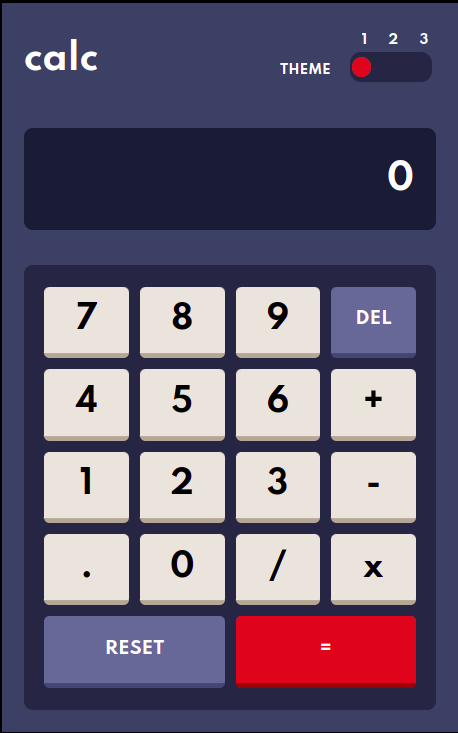

# Frontend Mentor - Calculator app solution

This is a solution to the [Calculator app challenge on Frontend Mentor](https://www.frontendmentor.io/challenges/calculator-app-9lteq5N29). Frontend Mentor challenges helps me by improving my coding skills though building realistic projects. 

## Table of contents

- [Frontend Mentor - Calculator app solution](#frontend-mentor---calculator-app-solution)
  - [Table of contents](#table-of-contents)
  - [Overview](#overview)
    - [The challenge](#the-challenge)
    - [Screenshot](#screenshot)
    - [Links](#links)
  - [My process](#my-process)
    - [Built with](#built-with)
    - [What I learned](#what-i-learned)
    - [Continued development](#continued-development)
  - [Author](#author)

**Note: Delete this note and update the table of contents based on what sections you keep.**

## Overview

### The challenge

Users should be able to:

- See the size of the elements adjust based on their device's screen size
- Perform mathmatical operations like addition, subtraction, multiplication, and division
- Adjust the color theme based on their preference

### Screenshot

### Links

- Live Site URL: [Calculator Project](https://eze-alarcon.github.io/Calculator-Frontend_Mentor/)

## My process

### Built with

- Semantic HTML5 markup
- CSS custom properties
- Flexbox
- Mobile-first workflow

### What I learned

I did this project right after finishing my JavaScript course at "CoderHouse" and after taking several add-on courses at "Platzi". Thanks to these courses I decided to start this project. 

At the beginning it was a bit difficult, thinking of a way to solve the problem while I had my mind on other problems of everyday life was a bit challenging but in the end I came up with a solution. To this day it may not be the best solution, for sure there are thousands of implementations better done than the one exposed in this project but this also serves as a reminder that "it is always better to do something than nothing". 

### Continued development

To this day I still think about the implementation I did for this project. I haven't changed it and I honestly don't think I will because a certain part of me wants to expose that even though it's not the best code, it does the job.

## Author

- Ezequiel Alarcon - [My Portfolio](https://www.your-site.com)
